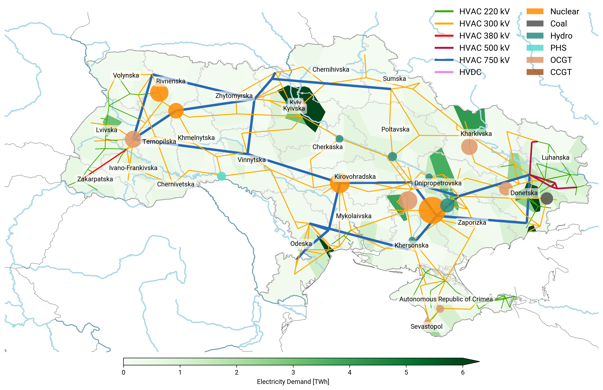
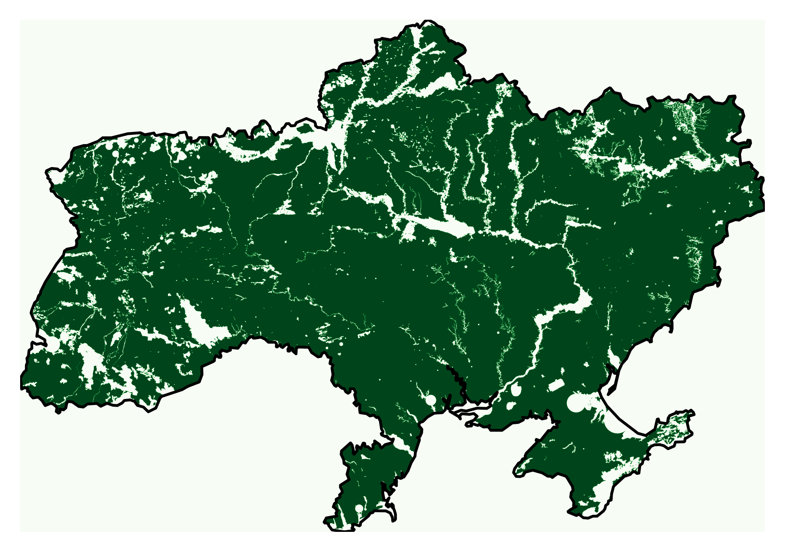
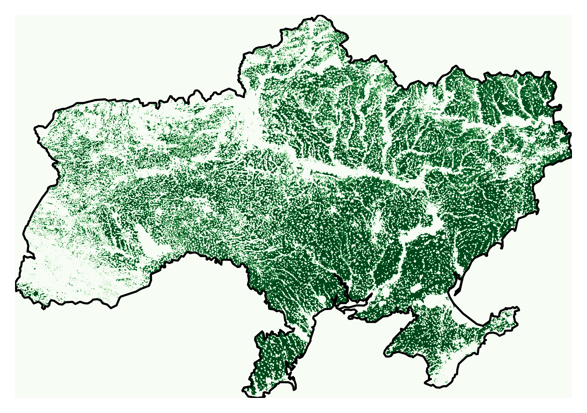
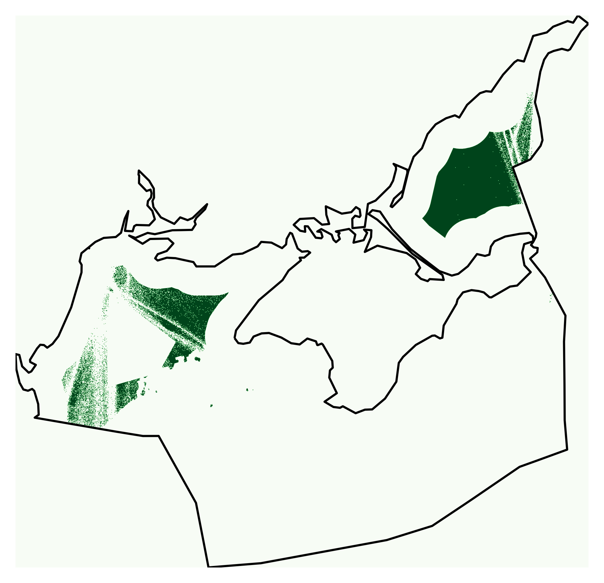

# @fig:lcoe: Levelised system cost of electricity for both economic growth scenarios

{#fig:lcoe}

# @fig:generation: Electricity mix for both economic growth scenarios

{#fig:generation}

# @fig:capacities-power: Installed power capacities for both economic growth scenarios

{#fig:capacities-power}

# @fig:capacities-energy: Installed energy capacities for both economic growth scenarios

{#fig:capacities-energy}

# @fig:time-series-summer: Generation time series for a selected week in summer

{#fig:time-series-summer}

# @fig:time-series-winter: Generation time series for a selected week in winter

{#fig:time-series-winter}

# @fig:transmission: Transmission grid

{#fig:transmission}

# @fig:solar: Eligible areas for solar deployment

{#fig:solar}

# @fig:onwind: Eligible areas for onshore wind deployment

{#fig:onwind}

# @fig:offwind-dc: Eligible areas for DC-connected offshore wind deployment

{#fig:offwind-dc}

# @fig:offwind-ac: Eligible areas for AC-connected offshore wind deployment

{#fig:offwind-ac}

# Note S1: Capital cost of new nuclear power capacities

For the capital cost of new nuclear power plants we assume 7,940\ EUR~2015~/kW in the default scenarios and apply a range of 1,985-11,910 EUR~2015~/kW in the global sensitivity analysis.
The default value is derived from the average cost range given for total capital cost (6,900--12,200\ USD~2019~/kW) in the Lazard report v13[@Lazard:2019].
This is converted to EUR~2015~/kW by applying an inflation rate of 2% and a currency conversion of 0.9\ EUR/USD, yielding 7,940\ EUR~2015~/kW.
<!-- USD2019 / 1.02^4 * 0.9 = EUR2015 -->
Newer cost estimates from the updated Lazard report v16[@Lazard:2023] based on the new Plant Vogtle in Georgia (USA) are higher (8,475--13,925\ USD~2023~/kW), yielding 8,603\ €~2015~/kW according to the same conversion approach.
NREL's Annual Technology Baseline (ATB) database (based on EIA Annual Energy Outlook 2023[@U.S.EnergyInformationAdministration:2023]) lists more optimistic estimates for 2023, stating a total cost of 6,768\ €~2015~/kW (8,811\ USD~2022~/kW).
In the ATB database, the lowest cost projections for 2030 and 2050 results in 5,937\ €~2015~/kW and 5,122\ €~2015~/kW, respectively.

# Bibliography
