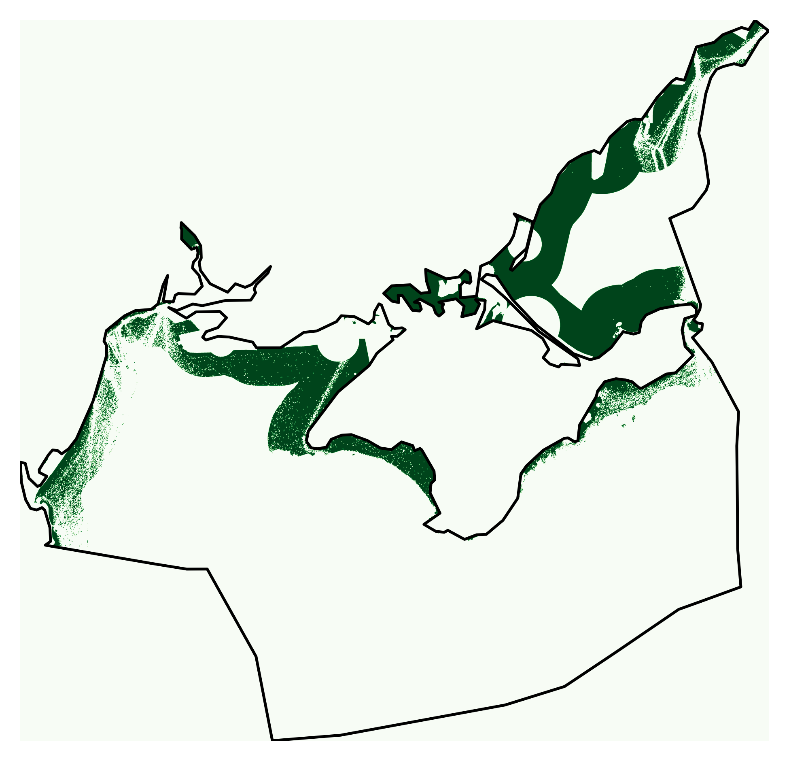

# @fig:lcoe: Levelised system cost of electricity for both economic growth scenarios

{#fig:lcoe}

# @fig:generation: Electricity mix for both economic growth scenarios

{#fig:generation}

# @fig:capacities-power: Installed power capacities for both economic growth scenarios

{#fig:capacities-power}

# @fig:capacities-energy: Installed energy capacities for both economic growth scenarios

{#fig:capacities-energy}

# @fig:time-series-summer: Generation time series for a selected week in summer

{#fig:time-series-summer}

# @fig:time-series-winter: Generation time series for a selected week in winter

{#fig:time-series-winter}

# @fig:transmission: Transmission grid

{#fig:transmission}

# @fig:solar: Eligible areas for solar deployment

{#fig:solar}

# @fig:onwind: Eligible areas for onshore wind deployment

{#fig:onwind}

# @fig:offwind-dc: Eligible areas for DC-connected offshore wind deployment

{#fig:offwind-dc}

# @fig:offwind-ac: Eligible areas for AC-connected offshore wind deployment

{#fig:offwind-ac}
